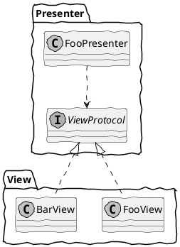

## はじめに

本記事は [Swift/Kotlin愛好会 Advent Calendar 2021](https://qiita.com/advent-calendar/2021/love_swift_kotlin) の17日目の記事です。
空いていたので埋めました。

「依存性逆転の原則」と「依存性の注入」を完全に理解したので説明します。

## 「依存性逆転の原則（DIP）」とは？

英語で「Dependency Inversion Principle」といい、「DIP」と略すことが多いです。
[SOLID](https://ja.wikipedia.org/wiki/SOLID) の5原則の1つです。

### 従来のレイヤーパターン

例えば [MVP](https://en.wikipedia.org/wiki/Model%E2%80%93view%E2%80%93presenter) アーキテクチャのViewとPresenterで考えてみます。
ViewとPresenterの間には以下の特徴があります。

- View（UI）はPresenterのことを知るべきではない
- PresenterはViewからメッセージを受け取り、それに基づいて処理を行い、Viewに反映する

これは「ViewはPresenterに依存せず、PresenterはViewに依存する」ということであり、「 __Presenter→View__ 」と表します。

簡潔にコードで表します。

```swift:FooPresenter.swift
class FooPresenter {
    private let view = FooView()
}
```

```FooView.swift
class FooView {
    func showMonster(_ monster: Monster) {
        nameLabel.text = monster.name
        iconImageView.image = monster.icon
    }
}
```

クラス図で表します。



```plantuml
@startuml

' ----------------------------------------
' スキン設定
' ----------------------------------------

' 可視性のアイコンを非表示にする
skinparam classAttributeIconSize 0

' モノクロにする
skinparam monochrome true

' 影をなくす
skinparam shadowing false

' 手描き風にする
skinparam handwritten true

' ----------------------------------------
' クラス定義
' ----------------------------------------

package Presenter {
  class FooPresenter
}

package View {
  class FooView
}

' ----------------------------------------
' 関連
' ----------------------------------------

FooPresenter --> FooView

@enduml
```

### 依存性逆転パターン

従来のレイヤーパターンだとPresenterが特定のViewに依存しているので、再利用しにくいです。
「 `FooView` のみでなく `BarView` も扱いたい」というときに困ります。

それを解決するため、PresenterがViewのインターフェースを提供します。
Viewはそのインターフェースを実装します。

簡潔にコードで表します。

```swift:FooPresenter.swift
protocol ViewProtocol {
    func showMonster(_ monster: Monster)
}

class FooPresenter {
    private let view: ViewProtocol

    init(view: ViewProtocol) {
        self.view = view
    }
}
```

```swift:FooView.swift
class FooView {}

extension FooView: ViewProtocol {
    func showMonster(_ monster: Monster) {
        nameLabel.text = monster.name
        iconImageView.image = monster.icon
    }
}
```

```swift:BarView.swift
class BarView {}

extension BarView: ViewProtocol {
    func showMonster(_ monster: Monster) {
        nameLabel.text = monster.name
        descriptionLabel.text = monster.description
    }
}
```

これで `FooPresenter` が `FooView` と `BarView` のどちらも扱えるようになりました。

「ViewはPresenterが提供するインターフェースに依存し、Presenterは特定のViewに依存しない」ということになり、「 __Presenter←View__ 」と表します。

クラス図で表します。



矢印を見てわかる通り、依存の方向が逆になりました。
このことを「依存性逆転の原則」といいます。

「ViewはPresenterに依存しないのに、なんでPresenter←Viewとなるの？」と疑問に思う人がいるかもしれません。
「逆転」はViewが直接Presenterに依存することを意味せず、 __Presenterが提供するインターフェースに依存する__ ことを意味します。
提供されたインターフェースを実装する、という考えがわかりづらいですが、今回だと「PresenterはViewにモンスターを表示する振る舞いを要求している、Viewはそれに従っている」と考えると、ViewがPresenterに依存していることがわかりやすいと思います。

Twitterで頂いた返信の説明がわかりやすいので、参考に載せます。

https://twitter.com/koher/status/1488868896601821186?s=20&t=O_hJ6DkfgZEAMhKa6e0aLA

## 「依存性の注入（DI）」とは？

英語で「Dependency Injection」といい、「DI」と略すことが多いです。

名前の通り、依存性を外部から注入することです。

先ほどの例だと、 `FooPresenter` はイニシャライザ経由で外部から依存性（View）を注入しています。

```swift:FooPresenter.swift
protocol ViewProtocol {
    func showMonster(_ monster: Monster)
}

class FooPresenter {
    private let view: ViewProtocol

    init(view: ViewProtocol) {
        self.view = view // !!!: 依存性を外部から注入している
    }
}
```

### DIの方法

DIの方法は大きく3つあり、上にいくほど望ましいです。

- Constructor Injection  
依存性を `private` かつ不変にできる
- Method Injection  
依存性を `private` にできるが、可変になる
- Setter Injection  
依存性を外部に公開する必要があり、可変にもなる

具体的な実装方法はググれば出てくるので割愛します。

### DIのメリット

#### 外部に依存せず対象クラスのテストを書ける

DIのメリットは「外部に依存せず対象クラスのテストを書ける」のみといっても過言ではありません。

先ほどの例ではViewのモックを作成して注入することで、PresenterはViewに依存せずテストを書けます。

モックにはメソッドが呼ばれた回数を記録するプロパティを用意すると、メソッドが適切に呼ばれているか確認しやすくなります。

```swift:ViewMock.swift
class ViewMock {
    var showMonsterCallCount = 0
}

extension ViewMock: ViewProtocol {
    func showMonster(_ monster: Monster) {
        showMonsterCallCount += 1
    }
}
```

Presenterで `foo()` というメソッド（内部で `view.showMonster()` が呼ばれていると仮定する）をテストする際のテストコードの例です。

```swift:FooPresenterTests.swift
class MonsterListPresenterTests: XCTestCase {
    func test_foo() {
        // Arrange（環境構築）
        let viewMock = ViewMock()
        let presenter = FooPresenter(view: viewMock)

        // Act（実行）
        presenter.foo()

        // Assert（動作確認）
        XCTAssertEqual(viewMock.showMonsterCallCount, 1)
    }
}
```

Viewに依存せず、純粋に `presenter.foo()` メソッドのみをテストするコードが書けました。

テストのAAA（Arrange-Act-Assert）パターンについては [こちら](https://github.com/Quick/Quick/blob/c81db820d66350863a9ae3647fbaef921ba5c066/Documentation/ja/ArrangeActAssert.md) をご参照ください。

#### 特定のフレームワークに依存しなくなる

例えばAlamofireのようなネットワーク通信のライブラリを直接使うのではなく、ラップしたクラスを外部から注入することで、特定のフレームワークに依存しなくなります。

```swift:FooInteractor.swift
// !!!: `import Alamofire` が不要になる

protocol HTTPClientProtocol {
    func request(requestBody: RequestBody) -> ResponseBody
}

class FooInteractor {
    private let httpClient: HTTPClientProtocol

    init(httpClient: HTTPClientProtocol) {
        self.httpClient = httpClient
    }
}
```

```swift:HTTPClient.swift
import Alamofire

class HTTPClient {}

extension HTTPClient: HTTPClientProtocol {
    func request(requestBody: RequestBody) -> ResponseBody {
        // Alamofireを使ってHTTP通信処理を行う
    }
}
```

これで例えばライブラリをAlamofireからAPIKitに変更すると決まっても、 `HTTPClient.swift` の修正のみで済みます。

特にFirebaseのような大規模なライブラリをラップして、さらに別モジュールに切り出しておくと、他のモジュールの依存関係がスッキリするのでオススメです。

## よくある質問

依存性に関してよくある質問と回答を紹介します。

### Q.矢印の向きが何を表しているかよくわかりません。

A.依存の方向を表しています。
「AがBに依存している」場合は「A→B」と書きます。

正直わかりづらいです。
こういうものとして覚えるしかないと思います。

### Q.「依存性逆転の原則」と「依存性の注入」は同じ意味ではないのですか？

A.違います。
「依存性逆転の原則」を実現するための手段として「依存性の注入」があります。

言葉が似ていてわかりづらいです。
個人的には「インターフェース（Swiftの場合はプロトコル）を介すことでモックに差し替えられるようになり、対象クラスのテストがしやすくなる」だけ覚えれば、言葉の意味を深く理解しなくてもいいと思っています。

### Q.DIにデメリットはないのですか？

A.あります。
テストを書かない場合、インターフェースを定義して外部からインスタンスを注入する必要がないので、その処理が冗長になります。
特に [Dagger](https://github.com/google/dagger) （Android）や [DryIoc](https://github.com/dadhi/DryIoc) （.NET）などのDIライブラリを使っている場合、負債になりやすいです。
逆にいえばテストを書く場合はメリットしかないといっても過言ではありません。

DIしてテストを書きやすくすることで設計がよくなることが多いですし、DIできるようにしないとテストを書くべき箇所でも書かなくなりがちなので、あえて冗長にしておくのもありだと思います。

### Q.DI時に依存性が逆転しないことはありますか？

~~A.私はないと思っています。
もしありましたらコメントなどでご指摘ください。~~

A.あります。
コメント（ [こちら](https://qiita.com/uhooi/items/03ec6b7f0adc68610426#comment-f71a6841a7ff1c878dd8) と [こちら](https://qiita.com/uhooi/items/03ec6b7f0adc68610426#comment-2cdf7aa943f271812de9) など）でご指摘いただいた通り、具体的な型にDIした場合は依存性が逆転しません。

私の勉強不足でしたが、インターフェース経由で注入することだけでなく、外部でインスタンスを生成して注入することはすべてDIと呼ぶようです。

### Q.複数のクラスに注入したい依存性（Loggerなど）があります。クラスの数だけ同じインターフェースを定義する必要がありますか？

A.依存性逆転の原則に厳密に従うとそうすべきですが、手間なので1つのみ定義すればいいと思います。
特にテスタブルにする目的のみでDIするなら、なおさら必要ありません。

## おわりに

これで「依存性逆転の原則」と「依存性の注入」を完全に理解することができました :relaxed: 

以上 [Swift/Kotlin愛好会 Advent Calendar 2021](https://qiita.com/advent-calendar/2021/love_swift_kotlin) の17日目の記事でした。

## 参考リンク

- [依存性逆転の原則 - Wikipedia](https://ja.wikipedia.org/wiki/依存性逆転の原則)
- [依存性の注入 - Wikipedia](https://ja.wikipedia.org/wiki/依存性の注入)
- https://twitter.com/the_uhooi/status/1488863988230148102?s=20&t=O_hJ6DkfgZEAMhKa6e0aLA
